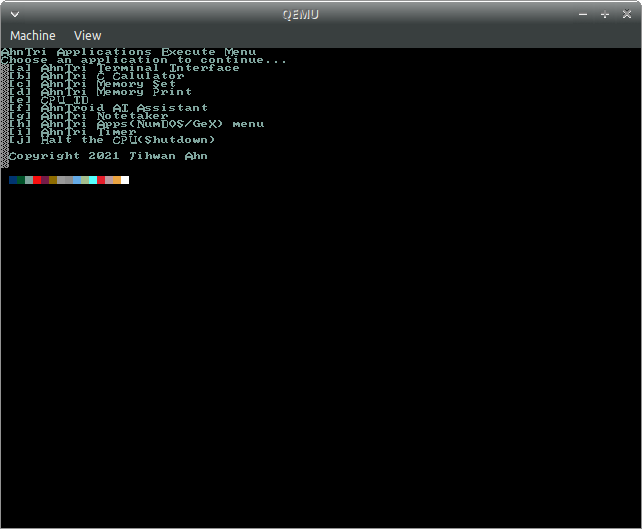
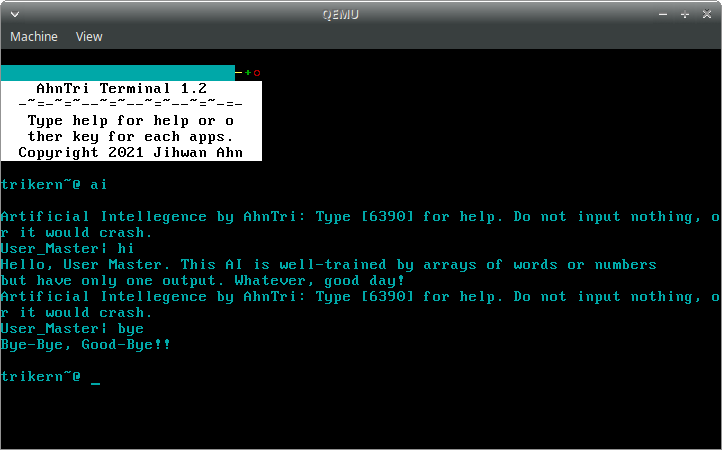
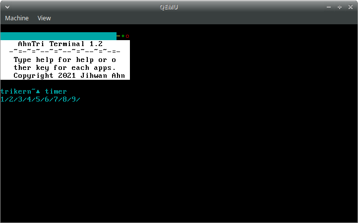

# AhnTri OS
[](https://forthebadge.com)
# Needed to be built with Xubuntu 20.04/18.04.
http://mirror.us.leaseweb.net/ubuntu-cdimage/xubuntu/releases/20.04/release/xubuntu-20.04.2.0-desktop-amd64.iso
https://cdimage.ubuntu.com/xubuntu/releases/20.04.2/release/xubuntu-20.04.2.0-desktop-amd64.iso
https://cdimage.ubuntu.com/xubuntu/releases/18.04/release/xubuntu-18.04.5-desktop-i386.iso

# Colors
16 Default Colors + 2 Premium colors
# What this project is all 'bout
This is for
 - People who don't want to trash thier old PC but has an useless USB
 - People who loved TUI from 80/90/00
 - People who just want to try out any OS
 - People who are AhnTri fans
 - People who are AhnTri Stargazers
 - Contributers(Owners of copyright)
 - Special Thankers
# Current status
- [x] Text mode
- [x] Descripter Tables(GDT, IDT)
- [x] Apps as file(.o)
- [x] ISRs
- [x] Change to graphics instead of text mode - framebuffer
- [x] A basic TTY that can fully supersede VGA text mode
- [x] IRQs
- [x] Programmable Interval Timer
- [ ] Language pack upgrade
- [ ] Paging
- [ ] ATA drivers and stuff
- [ ] Filesystem

# Multiboot
In order to be able to run it in your PC, copy and paste the code below.
```INI
menuentry "AhnTriOS" {
	multiboot /boot/directory/of/your/os/ATOS1.bin
}
```

# Screenshots!




