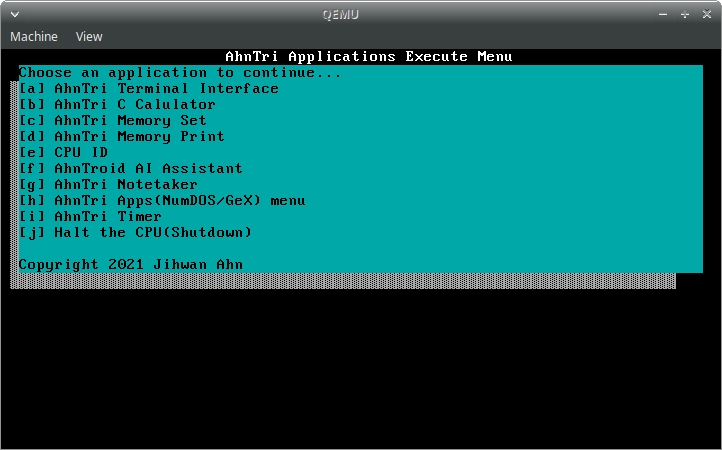

# AhnTri OS
[](https://forthebadge.com)
# Getting some Stargazer's Languages: https://forms.gle/GcfstgAjpzB3h9JP7
# The name `AhnTri` came from my last name `Ahn`.
Ahn is a **Korean** Last name. It's **not** chinese, don't mail or redditchat me in chinese.
I can't understand them.
https://en.wikipedia.org/wiki/Ahn_(Korean_surname)#Gwangju_Clan
# Recommend Ventoy for USB.
# What this project is all 'bout
This is for
 - People who don't want to trash thier old PC but has an useless USB
 - People who loved TUI from 80/90/00
 - People who just want to try out any OS
 - People who are AhnTri fans
 - People who are AhnTri Stargazers
 - Contributers(Owners of copyright)
 - Special Thankers
# Current status
- [x] Text mode
- [x] Descripter Tables(GDT, IDT)
- [x] Apps as file(.o)
- [x] IRQs
- [x] Programmable Interval Timer
- [ ] Paging
- [ ] ATA drivers and stuff
- [ ] Filesystem

# Multiboot
In order to be able to run it in your PC, copy and paste the code below.
```INI
menuentry "AhnTriOS" {
	multiboot /boot/directory/of/your/os/ATOS1.bin
}
```
# Screenshots



# The UI now looks like the 8090 TUI.
- And other modern-like UI apps.
