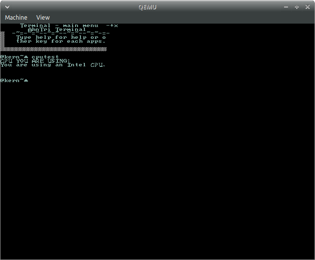

# AhnTri OS
[](https://forthebadge.com)
# I am KOREAN guy.
This is the Kernel and the CLI OS.
This is my hobby OS, now it can be run on real hardware, focused on bootable USBs.
Can be used as multipurpose like calculators and more. 
Has a simple code art in it and you can try it out at forker.h.
Now supporting text I/O, not NumDOS.
AhnTri/Fish Operating System
However, NumDOS is available at GeX(something like GUI, I mean, like Samsung DeX or Kali KeX)
Recommend Ventoy for USB.
Since I am just 13(korean age 15), my code will be super bad. 
And sorry for my slow updates; I need to go to school and I have exams.
OK, um... I have found out I have missed malloc h here and it wont build giving the error no function malloc and free
And I just made a new feature: memory copy.
Now it can memorize chars like a or b
I am looking forward to usernames and passwords, and some AI funtions for cbot.
# Announcement: My hobby OS AhnTri may not have active updates(it would probably have minor ones often) during my exam study period(April 6th-April 29th)
# Announcement again: I'm getting busy since tomorrow. I think I'll have no updates(1~3 in a week is maybe possible) until April 29th. May our soul be with AhnTri...
# 200th commit anniversary 4:24pm 3/37/2021
# What this project is all 'bout
This is for
 - People who don't want to trash thier old PC but has an useless USB
 - People who loved TUI from 80/90/00
 - People who just want to try out any OS
 - People who are AhnTri fans
 - People who are AhnTri Stargazers
 - Me
# Current status
Added feature(Accomplished)
- Terminal instead of NumDOS
- Better system
- UI change
- Additional functions in CCalc
- Renamed function `os_print_string` to `printf`
- Updated math.h for more efficient math
- small other changes
- PS/2 Mouse but it has a bug which makes the OS a mess.(So sorry but don't move your mouse when running in real hardware. I've done it and this but killed me.)
- GDT and malloc() memory managements
- memcpy() function
- Timer

WIW(What I Want, Unaccomplished yet)
- Paging(Able to do it quick)
- Directory access(Long...)
- Graphics
- Fonts

# Multiboot
In order to be able to run it in your PC, copy and paste the code below.
```INI
menuentry "AhnTriOS" {
	multiboot /boot/directory/of/your/os/ATOS1.bin
}
```
# Screenshots




# The UI now looks like the 8090 TUI.
- And other modern-like UI apps.
