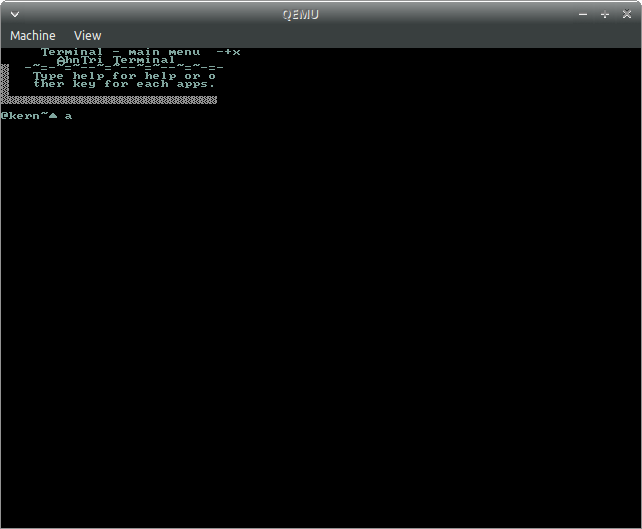
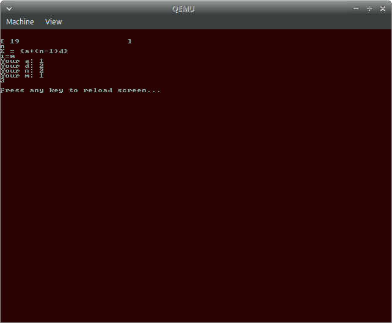

# 안트라이 OS
[](https://forthebadge.com)
# 주분투 20.04/18.04 빌드 추천.
http://mirror.us.leaseweb.net/ubuntu-cdimage/xubuntu/releases/20.04/release/xubuntu-20.04.2.0-desktop-amd64.iso
https://cdimage.ubuntu.com/xubuntu/releases/20.04.2/release/xubuntu-20.04.2.0-desktop-amd64.iso
https://cdimage.ubuntu.com/xubuntu/releases/18.04/release/xubuntu-18.04.5-desktop-i386.iso

# 색상
16 Default Colors + 2 Premium colors
# What this project is all 'bout
This is for
 - People who don't want to trash thier old PC but has an useless USB
 - People who loved TUI from 80/90/00
 - People who just want to try out any OS
 - People who are AhnTri fans
 - People who are AhnTri Stargazers
 - Contributers(Owners of copyright)
 - Special Thankers
# 지금까지 한것...
- [x] 프레임버퍼(어려웠음 ㅋㅋㅋ)
- [x] Descripter Tables(GDT, IDT)
- [x] Apps as file(.o)
- [x] ISRs
- [x] 프레임버퍼로 완전 이주(ㅋㅋㅋ)
- [x] A basic TTY that can fully supersede VGA text mode
- [x] IRQs
- [x] 스톱워치
- [ ] 언어팩 완성(있긴 한데 좋지 않음)
- [ ] 페이징(지금 하는중)
- [ ] ATA 드라이버
- [ ] 파일시스템

# Multiboot
In order to be able to run it in your PC, copy and paste the code below.
```INI
menuentry "AhnTriOS" {
	multiboot /boot/directory/of/your/os/ATOS1.bin
}
```

# Screenshots




