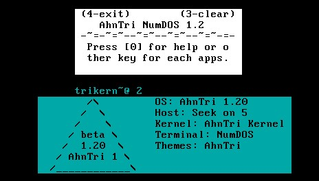

# Welcome to AhnTri Page

AhnTri is my hobbiest OS yet and it is in developmeent.

### What it is all about

This is little more than some freeware OS which can run with Linux thanks to GRUB so that it can multiboot. People who know C and Assembly can make something like this.
So, it is very, very simple.
In able to run it, copy and paste the code below.

```INI
menuentry "TriOS2.10" {
	multiboot /boot/TriOS2.bin
}
```
# Current status
Added feature(Accomplished)
- DOS Box GUI
- Organized structue
- Notes(doesn't save files, just keyboard I/O) --> Looking forward to save
- Power functions in CCalc
- Grub which could be run with Linux

WIW(What I Want, Unaccomplished yet)
- Memory mamgaement( Directories, Filesystem, save/open files...)
- Time
- Window multi taksing

# How to build
In Linux, type `~$ ./run.sh`. I use Xfce Ubuntu(Xubuntu), and I get something like this:

Then it would build them. In windows which is not WSL, you can use virtual machine player and pre-built ISO image to try it.

# Screenshot
Just a screenshot and the window one whould probably get when typed `2` in the NumDOS terminal.


# Pre-built
Go to the `build` folder of the branch `main`.
